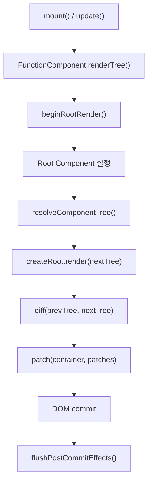

 
 

# Mini React Clone for Jungle Demo
Virtual DOM, `diff/patch`, function component, state, hooks(`useState`, `useEffect`, `useMemo`)를 바이브 코딩으로 구현한 Mini React 프로젝트입니다.

## 핵심 구조
이 Mini React는 컴포넌트 실행, VDOM 생성, `diff/patch`, effect 실행을 아래 순서로 처리합니다.

### 한 줄 요약
- 렌더 단계에서 root component를 실행하고 plain VDOM tree를 만듭니다.
- 커밋 단계에서 이전 tree와 비교한 결과만 실제 DOM에 반영합니다.
- DOM 반영이 끝난 뒤 post-commit effect를 실행합니다.

### 구조별 역할
- `FunctionComponent`
  - `mount()`, `update()`, `unmount()`의 시작점이며 `renderTree()`와 `commitRender()`로 전체 렌더 사이클을 관리합니다.
- `resolveComponentTree()`
  - function component를 재귀적으로 호출해 최종 plain VDOM tree로 해석합니다.
- `createRoot()`
  - 이전 tree를 기억하고, 새 tree가 들어오면 `diff()`와 `patch()`를 연결해 DOM 갱신을 수행합니다.
- `diff() / patch()`
  - 이전 tree와 다음 tree를 비교해 변경된 부분만 실제 DOM에 반영합니다.
- `hookRuntime / hooks`
  - hook slot을 관리하고, `useEffect` 계열 작업을 DOM commit 이후 `flushPostCommitEffects()`에서 실행합니다.

## 회고
### 협업
- 분업이 아닌 동료 학습으로서의 협업으로 접근
- AI가 생성한 코드에 대해 페어 프로그래밍을 하듯이 다같이 이해함
- 결과물을 한번에 만드는 것이 아니라 단계별로 나누어 이해하고 다음 단계의 기능을 구현함
- 이전 수요 코딩회에 비해서 매우 많은 보람과 성취감을 느낌

         

## 핵심 구현
### Function Component
- function component를 호출해 vnode를 만든 뒤, 다시 재귀적으로 plain vnode tree로 해석합니다.
- child component는 지원하지만, 현재 hooks는 root component에서만 허용합니다.

### State
- `FunctionComponent.setState()`는 object patch merge 방식으로 동작합니다.
- 별도로 hooks 기반 `useState()`도 지원합니다.
- 상태가 바뀌면 root instance가 `update()`를 호출해 다시 렌더링합니다.

### Hooks
- `useState`
  - lazy initializer 지원
  - functional update 지원
- `useEffect`
  - render 중 바로 실행하지 않고 DOM commit 이후 실행
  - deps가 바뀌면 이전 cleanup을 먼저 호출
- `useMemo`
  - dependency array가 같으면 캐시값 재사용

## React와의 차이
- `key` 기반 reconciliation 없음
- `Fiber` / concurrent rendering 없음
- batched update 없음
- child component hooks 미지원
- synthetic event system 없음
- scheduler / priority 제어 없음

## 테스트
### 단위 테스트
- `tests/component.test.js`
  - function component 해석
  - update 시 기존 DOM 유지
- `tests/state.test.js`
  - `setState` merge
  - demo app의 counter / todo 상호작용
- `tests/hooks-runtime.test.js`
  - hook slot 재사용
  - hook 사용 위치 제한
  - post-commit effect queue
- `tests/hooks-api.test.js`
  - `useState` lazy init / functional update
  - `useEffect` cleanup
  - `useMemo` cache 재사용
